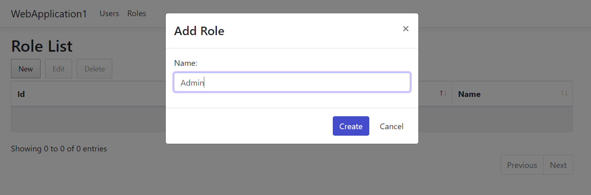
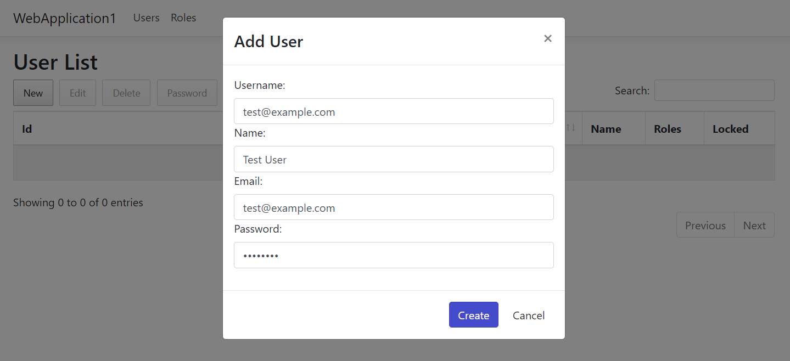
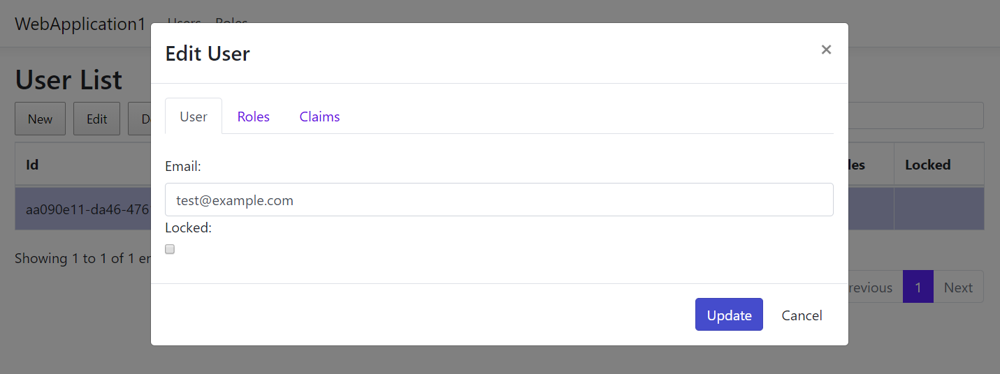
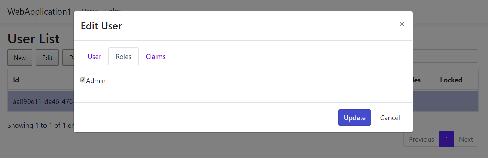
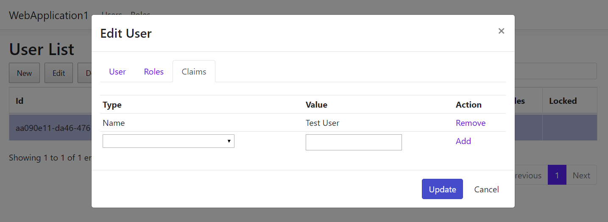

# Identity Manager UI
Identity management system for [ASP.NET Core Identity](https://github.com/aspnet/AspNetCore/tree/master/src/Identity) for use with .NET Core 3.1 and Bootstrap 4.

## Introduction
When creating a new ASP.NET Core project you have the option to change the authentication to individual user accounts that adds a reference to [Microsoft.AspNetCore.Identity.UI](https://www.nuget.org/packages/Microsoft.AspNetCore.Identity.UI/) to include the identity system into your website. This includes registration, login and several pages related to user account self management like 2FA and password reset.

The missing piece to the puzzle is user management for the site. For ASP.NET membership there was [ASP.NET Website Administration Tool (WSAT)](https://docs.microsoft.com/en-us/aspnet/web-forms/overview/older-versions-getting-started/deploying-web-site-projects/users-and-roles-on-the-production-website-cs) and for ASP.NET Identity there was [Identity Manager](http://brockallen.com/2014/04/09/introducing-thinktecture-identitymanager/) by Brock Allen.  AFAIK there is no solution available for ASP.NET Core Identity so this repo is an effort to remedy that.

## UI Integration

Identity Manager UI was developed as a [Razor class library](https://docs.microsoft.com/en-us/aspnet/core/razor-pages/ui-class) that simplifies integrating it into an existing project.  The UI has an [area](https://docs.microsoft.com/en-us/aspnet/core/mvc/controllers/areas) named `IdentityManager` (containing views for both users and roles) that requires area routing.

```CSharp
app.UseEndpoints(endpoints =>
{
    endpoints.MapControllerRoute(
        name: "areas",
        pattern: "{area}/{controller=Home}/{action=Index}/{id?}");
});
```

Also in `Startup` you will have to include references to `ApplicationUser` and `ApplicationRole` that are defined inside the UI component.

```CSharp
services.AddDefaultIdentity<ApplicationUser>()
    .AddRoles<ApplicationRole>()
    .AddEntityFrameworkStores<ApplicationDbContext>();
```

In your `ApplicationDbContext` you need to define the following navigation properties.

```CSharp
protected override void OnModelCreating(ModelBuilder builder)
{
    base.OnModelCreating(builder);

    builder.Entity<ApplicationUser>().HasMany(p => p.Roles).WithOne().HasForeignKey(p => p.UserId).IsRequired().OnDelete(DeleteBehavior.Cascade);
    builder.Entity<ApplicationUser>().HasMany(e => e.Claims).WithOne().HasForeignKey(e => e.UserId).IsRequired().OnDelete(DeleteBehavior.Cascade);
    builder.Entity<ApplicationRole>().HasMany(r => r.Claims).WithOne().HasForeignKey(r => r.RoleId).IsRequired().OnDelete(DeleteBehavior.Cascade);
}
```

## Setup
As the example project uses [FileContextCore](https://github.com/morrisjdev/FileContextCore) as the database provider there is no database setup needed since the ASP.NET Identity Core tables are stored in files, however for your own project you should use a [Database Provider](https://docs.microsoft.com/en-us/ef/core/providers/) to store these.

Run the project and you will be able to use the website to manage users, roles and claims.  Please note that authentication is not required to use the website since the project uses middleware (for demonstration purposes only) that creates a dummy user with the Admin role.

## Features
The first thing that you will likely do is create a new administrator role to manage additional users.



Once done you can create a new user by providing basic information like username and password.



After the user has been created you can then edit email address and lock account if required. 



In the user edit dialog you can select the Roles tab to assign user to previously defined roles.



In addition you can also select the Claims tab to add or remove claims to the user being edited.


